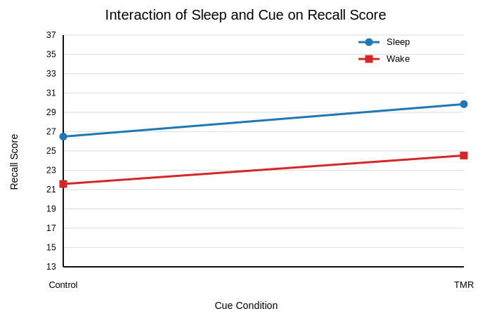

# Effects of Sleep and Targeted Memory Reactivation on Recall Performance

[Download PDF version](./apa7_sleep_memory_report.pdf)

## Abstract
This report presents a 2 × 2 between-subjects analysis of variance (ANOVA) examining memory recall as a function of sleep condition (Sleep vs. Wake) and cue condition (TMR vs. Control). Significant main effects of sleep and cue condition were observed, indicating higher recall after sleep and under TMR. The Sleep × Cue interaction was not statistically significant. Descriptive statistics and follow-up independent-samples comparisons are reported to support interpretation.

## Introduction
Sleep is often associated with improved consolidation of recently learned information. Targeted memory reactivation (TMR) has been proposed as an intervention that can further enhance consolidation by presenting memory-related cues. The current analysis evaluates whether recall differs as a function of sleep state, cue condition, and their interaction in a 2 × 2 factorial design.

## Methods
### Design and Data
The dataset included 80 participants distributed evenly across four between-subjects cells (Sleep–TMR, Sleep–Control, Wake–TMR, Wake–Control; n = 20 per cell). The outcome variable was recall score.

### Statistical Analysis
A two-way between-subjects ANOVA tested main effects of sleep and cue condition and their interaction. Follow-up independent-samples *t* tests compared cue effects within sleep levels and sleep effects within cue levels. Partial η² is reported as effect size for ANOVA terms.

## Results
The main effect of sleep was significant, *F*(1, 76) = 42.01, *p* < .001, partial η² = 0.356. The main effect of cue was significant, *F*(1, 76) = 16.01, *p* < .001, partial η² = 0.174. The Sleep × Cue interaction was not statistically significant, *F*(1, 76) = 0.07, *p* = .798, partial η² = 0.001.

Follow-up independent-samples comparisons showed that TMR outperformed control cueing in the Sleep condition, *t*(38) = 2.83, *p* = .007, and in the Wake condition, *t*(38) = 2.84, *p* = .007. Sleep also outperformed Wake both under TMR, *t*(38) = 4.69, *p* < .001, and under Control, *t*(38) = 4.48, *p* < .001.

### Descriptive Statistics

| Sleep | Cue | *n* | *M* | *SD* | *SE* |
|---|---|---:|---:|---:|---:|
| Sleep | TMR | 20 | 29.85 | 3.92 | 0.88 |
| Sleep | Control | 20 | 26.49 | 3.58 | 0.80 |
| Wake | TMR | 20 | 24.54 | 3.22 | 0.72 |
| Wake | Control | 20 | 21.58 | 3.36 | 0.75 |

### Interaction Graph

## Conclusion
Recall performance was higher in Sleep than Wake and higher in TMR than Control, indicating reliable main effects of sleep and cueing. However, there was no evidence that the cueing effect differed by sleep state (non-significant interaction). These findings support additive benefits of sleep and TMR in this sample rather than a multiplicative interaction.